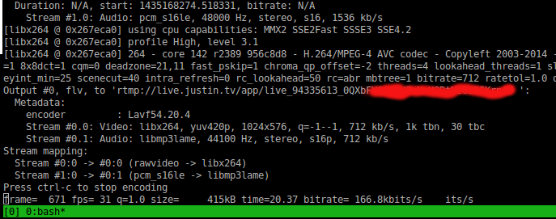
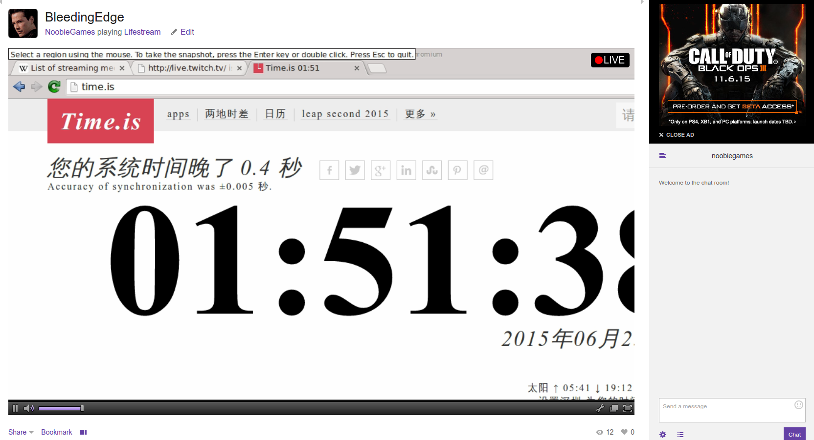

LiveStreamer
============
Broadcasting your Linux desktop to Twitch

    A command-line live video/audio streamer

Preparation
-----------
* You should install *ffmpeg*, *libav-tools* before streaming. The script `auto_prepare.sh` does the job for you.
* Start video streaming only from one script file, mostly for linux platform. This works on ubuntu 14.04 very well.
* For live video streaming on twitch, you should have a twitch account and the twitch key stored in a file *twitch_key.txt* under this folder.
* Try ```$~ ./livestreamer.sh```

Here what it looks in terminal

> 

And the live show on twitch

> 
